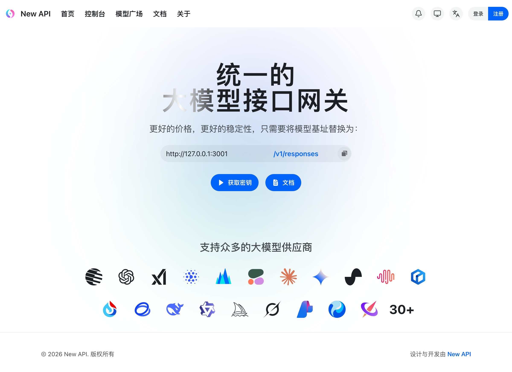

# new-api

[](./VERSION)
[](./LICENSE)
[](./go.mod)
[](./docker-compose.yml)

一站式 AI API 网关：聚合 OpenAI、Claude、Gemini、Azure、AWS Bedrock 等上游，对外提供 OpenAI 兼容接口、用户管理、计费、限流、日志和管理后台。



## 这是什么

`new-api` 是可自托管的大模型接口网关。你把多个上游模型、渠道 Key、价格策略和用户额度统一放进一个后台，对外只暴露一套兼容 OpenAI 的 API。

## 和上游有什么区别

本仓库基于 `QuantumNous/new-api` 独立演进，保留 AGPL 许可和上游来源说明，但路线、发布节奏和功能取舍由本仓库维护。

当前重点增强：

- 企业 SSO：JWT Direct、Trusted Header、CAS、OIDC、OAuth、Passkey
- 协议转换：OpenAI Chat、OpenAI Responses、Claude、Gemini 等格式适配，支持按策略做 Chat/Responses 双向转换和 Responses 自定义工具桥接
- 计费能力：阶梯计费表达式、工具定价、模型价格维护、历史消费金额修正
- 渠道策略：Header Profile、AI Coding CLI 动态请求头透传、模型测试运行配置
- 运营后台：请求/响应内容日志、Dashboard、排行、筛选联想、邀请返利、礼品码
- 部署形态：Docker、Release 二进制、Tauri 2 桌面客户端、隔离开发环境

## 谁在用

适合需要统一管理多家模型供应商的团队、个人工作室和内部平台：统一入口、统一鉴权、统一计费、统一审计，同时保留自托管和二次开发能力。

## Quick Start

最多三步启动本地 Docker 服务：

```bash
git clone https://github.com/MisonL/new-api.git
cd new-api
cp .env.example .env
```

在 `.env` 中至少设置稳定密钥：

```bash
SESSION_SECRET=replace-with-stable-secret
CRYPTO_SECRET=replace-with-stable-secret
```

启动并验证：

```bash
docker compose up -d
curl -fsS http://127.0.0.1:3000/api/status
```

默认访问：

```text
http://127.0.0.1:3000
```

不要把本地试运行直接指向生产数据库或生产数据目录。需要保留配置时，先备份 `.env`、数据目录和数据库卷。

## Release 安装

下载地址：

- https://github.com/MisonL/new-api/releases

构建产物命名：

- 后端服务：`new-api_<version-no-v>_<os>_<arch>[.exe]`
- 桌面客户端：`new-api-desktop_<version-no-v>_<os>_<arch>.<ext>`
- 校验文件：`new-api_<version-no-v>_checksums_<os>.txt`、`new-api-desktop_<version-no-v>_checksums.txt`

后端二进制最小启动示例：

```bash
chmod +x ./new-api_1.1.0_linux_amd64
export SESSION_SECRET='replace-with-stable-secret'
export CRYPTO_SECRET='replace-with-stable-secret'
./new-api_1.1.0_linux_amd64 --port 3000 --log-dir ./logs
```

## 配置

| 变量                | 用途             | 备注                     |
| ------------------- | ---------------- | ------------------------ |
| `SESSION_SECRET`    | 会话签名密钥     | 必填，必须稳定           |
| `CRYPTO_SECRET`     | 敏感数据加密密钥 | 必填，必须稳定           |
| `SQL_DSN`           | 数据库连接       | 未设置时使用 SQLite      |
| `REDIS_CONN_STRING` | Redis 连接       | 可选，用于缓存和共享状态 |
| `NEW_API_IMAGE`     | Docker 镜像      | 正式部署建议固定版本     |
| `NEW_API_DATA_DIR`  | 数据目录         | 建议显式设置             |
| `NEW_API_LOG_DIR`   | 日志目录         | 建议显式设置             |

支持 SQLite、MySQL、PostgreSQL。跨数据库改动必须保持三者兼容。

## 开发环境

后端与前端常用验证：

```bash
go test ./controller ./model ./relay/common ./relay/helper ./service
cd web/default && bun install
cd web/default && bun run lint
cd web/default && bun run build
```

完全隔离开发环境使用独立 `new-api`、PostgreSQL、Redis、数据目录、日志目录和端口：

```bash
cp deploy/env/dev-isolated.env.example deploy/env/dev-isolated.env
docker compose -f deploy/compose/dev-isolated.yml --env-file deploy/env/dev-isolated.env up -d
```

使用最新代码重建隔离开发环境：

```bash
scripts/build-docker-local.sh new-api-local:dev
docker compose -f deploy/compose/dev-isolated.yml --env-file deploy/env/dev-isolated.env up -d --no-deps --force-recreate new-api
curl -fsS http://127.0.0.1:3001/api/status
```

确认运行版本时，不能只看容器 `healthy`，必须比对 Git 提交和容器构建信息：

```bash
git rev-parse HEAD
git rev-parse origin/main
docker exec new-api-dev-isolated-new-api-1 /new-api --build-info
```

只有运行中容器的 `commit` 与目标 Git 提交一致，才可表述为开发环境已更新到最新代码。

## 文档索引

- [CHANGELOG](CHANGELOG.md)
- [渠道模型测试运行配置](docs/channel/model_test_runtime_config.md)
- [邀请返利与礼品码](docs/operations/invitation-rebate-gift-code.md)
- [模型价格维护与历史日志修正](docs/operations/pricing-maintenance.md)
- [协议转换自定义工具桥接复核](docs/reviews/CR-PROTOCOL-CONVERSION-CUSTOM-TOOLS-2026-05-13.md)
- [隔离开发环境复核记录](docs/reviews/CR-DEV-ISOLATED-VERIFY-2026-05-07.md)
- [部署构建可追溯审计](docs/reviews/CR-DEPLOY-BUILD-TRACEABILITY-2026-05-01.md)

## Star History

[](https://www.star-history.com/#MisonL/new-api&Date)

## License

本项目遵循 [GNU Affero General Public License v3.0](LICENSE)。

上游项目为 `QuantumNous/new-api`。本仓库保留必要的许可证文本、版权与修改声明、上游来源说明，并在此基础上独立维护。
